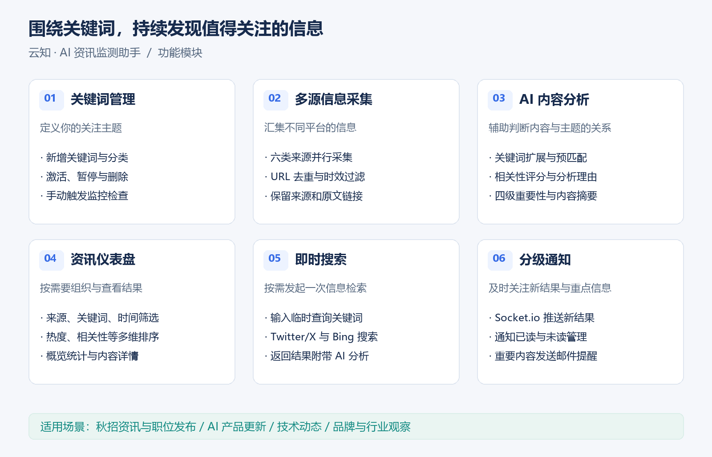
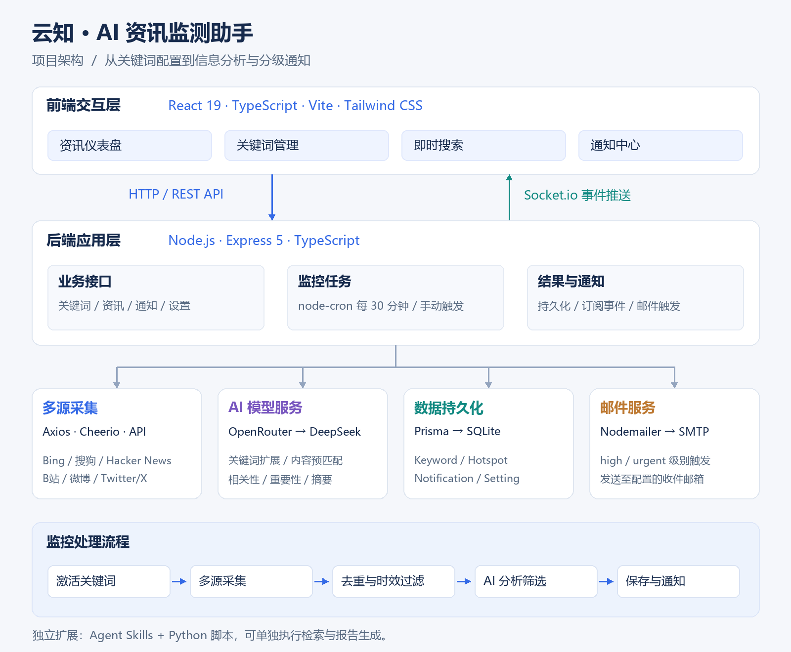

# 云知 · AI 资讯监测助手

> 输入关注的关键词，让资讯主动找到你。

云知是一款基于大模型的关键词资讯监测工具，支持从多个信息源聚合内容，通过 AI 进行相关性分析、重要性分级和摘要生成，并通过页面推送与邮件通知帮助用户持续跟踪关注的动态。

用户可以围绕公司、岗位、产品、技术或行业设置关键词，将分散的信息集中到同一个工作台，完成从信息发现、筛选到查看与提醒的流程。

## 开发动机

项目的想法来源于准备秋招时的信息收集需求：招聘启动、职位发布和补录消息分散在不同平台，需要反复搜索公司和岗位名称，再逐条判断是否与自己相关。重复查找和筛选占用了时间，也容易错过值得关注的消息。

因此，云知将这一需求抽象为通用的关键词监测流程：用户定义关注主题，系统定期采集信息、辅助筛选并发送提醒。秋招动态和职位信息是其中一个使用场景，同样的能力也可用于跟踪 AI 产品更新、技术资讯、品牌动态和行业热点。

| 使用场景 | 示例关键词 | 关注内容 |
| --- | --- | --- |
| 秋招与职位信息 | 阿里云 校园招聘、商业技术 管培生 | 招聘启动、职位发布、补录等公开线索 |
| AI 产品跟踪 | DeepSeek、通义千问 | 模型发布、产品更新与应用动态 |
| 技术资讯 | React、开源数据库 | 版本发布、技术文章与社区讨论 |
| 品牌与行业观察 | 品牌名称、行业主题 | 产品消息、新闻报道与讨论热点 |

## 项目功能



### 1. 关键词监控管理

- 新增监控关键词并设置分类。
- 激活、暂停或删除关键词，管理持续关注的主题。
- 每 30 分钟执行一次定时检查，也可手动触发监控任务。

### 2. 多源资讯采集

- 聚合 Twitter/X、Bing、Hacker News、搜狗、B站和微博的公开信息。
- 并行请求多个来源，汇总成功返回的内容。
- 对结果进行 URL 去重、发布时间过滤与来源优先级排序。
- 保留来源、原文链接、发布时间及平台返回的互动数据，方便进一步查看。

### 3. AI 内容分析

- 通过 OpenRouter 调用 DeepSeek，分析内容与监控关键词的关联。
- 输出 0–100 分的相关性评分、评分理由及主题关联摘要。
- 将重要性分为 low、medium、high、urgent 四个等级。
- 结合模型判断、相关性阈值和关键词提及情况筛选内容。
- 扩展关键词的别称、缩写及中英文变体，用于内容预匹配；缓存扩展结果以避免同一关键词重复调用。

### 4. 资讯仪表盘

- 展示资讯总量、今日新增、紧急资讯等概览信息。
- 按来源、重要性、关键词和时间范围筛选内容。
- 按发现时间、发布时间、重要性、相关性或热度排序。
- 在信息卡片中查看摘要、评分理由、作者和互动数据，并跳转原文。

### 5. 即时搜索

- 输入临时关键词，按需发起检索，无需先创建长期监控任务。
- 通过 Twitter/X 和 Bing 获取结果，并附带 AI 分析。
- 将一次性信息查找与持续关键词监控结合使用。

### 6. 分级通知

- 通过 Socket.io 推送新资讯，页面无需手动刷新即可接收更新。
- 在通知中心查看消息，管理已读、未读状态及历史通知。
- 配置 SMTP 后，对 high 和 urgent 级别的内容发送邮件提醒。

### 7. Agent Skills 扩展

提供由技能说明、Python 采集脚本和分析参考文档组成的独立技能包，支持在兼容 Agent Skills 的工具中执行资讯检索与报告生成。该扩展可独立于 Web 服务使用，详见 [技能说明](skills/hot-monitor/SKILL.md)。

## 技术架构

项目采用 React + Express 前后端分离架构。后端负责关键词管理、信息采集、模型分析和通知处理，通过 Prisma 管理 SQLite 数据；前端通过 REST API 获取数据，并通过 Socket.io 接收事件更新。



可缩放版本：[架构图 SVG](docs/assets/architecture.svg) · [功能模块图 SVG](docs/assets/features.svg)。

| 层次 | 技术选型 | 主要职责 |
| --- | --- | --- |
| 前端展示 | React 19、TypeScript、Vite 7 | 页面交互、状态管理、接口请求与构建 |
| 样式与交互 | Tailwind CSS、Framer Motion | 页面样式、响应式布局与交互动效 |
| 后端服务 | Node.js、Express 5、TypeScript | REST API、监控任务与业务处理 |
| 数据采集 | Axios、Cheerio、平台 API | 网络请求、页面解析与结构化数据提取 |
| AI 服务 | OpenRouter SDK、DeepSeek | 关键词扩展、内容评分、分级与摘要 |
| 数据持久化 | Prisma 6、SQLite | 关键词、资讯、通知与配置存储 |
| 实时通信 | Socket.io | 关键词订阅与消息推送 |
| 任务调度 | node-cron | 周期性触发资讯检查 |
| 邮件通知 | Nodemailer、SMTP | 按重要性发送邮件提醒 |

模型调用使用 OpenRouter，内容分析与关键词扩展的模型配置位于 `server/src/services/ai.ts`。应用可部署在云服务器上，模型服务与应用运行环境相互独立。

### 监控处理流程

1. **读取任务：**获取处于激活状态的监控关键词。
2. **扩展关键词：**生成并缓存关键词变体，作为后续内容匹配的参考。
3. **聚合信息：**并行检索多个来源，汇总返回结果。
4. **整理候选内容：**执行 URL 去重、时效过滤和来源排序，跳过已保存内容。
5. **分析与筛选：**结合关键词预匹配结果调用模型，根据相关性和重要性判断保留内容。
6. **保存与提醒：**将结果和通知写入数据库，推送页面事件，并对重要资讯发送邮件。

### 核心数据模型

| 模型 | 保存的信息 |
| --- | --- |
| `Keyword` | 关键词、分类、启停状态及关联资讯 |
| `Hotspot` | 标题、内容、来源、原文链接、AI 分析、作者及互动数据 |
| `Notification` | 通知标题、内容、已读状态和关联资讯 ID |
| `Setting` | 键值形式的应用设置 |

## 快速开始

以下步骤使用 Windows PowerShell，在本机或 Windows ECS 中均可用于开发环境验证。

### 1. 环境准备

- Git。
- Node.js 22 系列，版本至少为 22.12.0。
- 可用的 OpenRouter API Key 和对应模型的调用额度。
- Twitter/X 采集需要 twitterapi.io 的 API Key；邮件提醒需要 SMTP 配置。

### 2. 获取代码

```powershell
git clone https://github.com/Lincoln-625/yunzhi-monitor.git
cd yunzhi-monitor
```

已有代码时直接进入项目根目录。私有仓库需先完成 GitHub 身份验证，参见 [仓库连接说明](docs/GITHUB_SETUP.md)。

### 3. 配置环境变量

仅在没有 `.env` 时复制模板，避免覆盖已有配置：

```powershell
if (!(Test-Path 'server/.env')) {
    Copy-Item 'server/.env.example' 'server/.env'
}
notepad server/.env
```

| 配置项 | 用途 |
| --- | --- |
| `DATABASE_URL` | SQLite 数据库连接，模板值为 `file:./dev.db` |
| `PORT` | 后端端口，默认 `3001` |
| `CLIENT_URL` | 前端地址，本地默认 `http://localhost:5173` |
| `OPENROUTER_API_KEY` | OpenRouter 模型调用凭证 |
| `TWITTER_API_KEY` | twitterapi.io 调用凭证；不使用时留空 |
| `SMTP_HOST` / `SMTP_PORT` / `SMTP_SECURE` | SMTP 服务地址、端口及加密配置 |
| `SMTP_USER` / `SMTP_PASS` | 发件账号及邮件服务要求的授权凭证 |
| `NOTIFY_EMAIL` | 接收提醒的邮箱 |

将需要的占位值替换为真实配置；不使用的可选服务留空。密钥仅保存在后端环境配置中，不提交到 Git 仓库。

### 4. 安装依赖并初始化数据库

在项目根目录执行：

```powershell
cd server
npm ci
npx prisma generate
npx prisma db push
cd ../client
npm ci
cd ..
```

`db push` 用于本地开发初始化；更新已有数据库时应先备份数据，再根据结构变更选择迁移方式。

### 5. 启动应用

终端一，在项目根目录启动后端：

```powershell
cd server
npm run dev
```

终端二，在项目根目录启动前端：

```powershell
cd client
npm run dev
```

| 服务 | 默认地址 |
| --- | --- |
| 前端页面 | http://localhost:5173 |
| 后端 API | http://localhost:3001/api |
| 健康检查 | http://localhost:3001/api/health |

如端口被占用，以启动日志为准，并同步调整相关配置。进入页面后，添加关键词、确认启用，再点击手动检查即可体验监控流程。

## 使用说明

- **监控范围：**系统基于关键词检索公开内容，信息源返回数量与可用性受网络、接口和页面变化影响。
- **结果判断：**AI 评分与摘要用于辅助筛选，具体事实需结合原文确认；招聘信息应以企业官方发布为准。
- **时效规则：**监控流程会过滤有明确发布时间且超过七天的内容；无发布时间的结果暂时保留。
- **通知条件：**邮件服务配置完整且内容被评为 high / urgent 时，才会发送邮件。
- **运行方式：**定时任务在后端进程运行期间执行；开发时关闭后端进程会停止监控。

## 项目结构

```text
yunzhi-monitor/
├── client/                   前端应用
│   └── src/
│       ├── components/       筛选栏与 UI 组件
│       ├── services/         API 与 Socket.io 客户端
│       └── utils/            排序与时间处理
├── server/                   后端应用
│   ├── prisma/               数据模型与迁移文件
│   └── src/
│       ├── routes/           关键词、资讯、通知和设置接口
│       ├── services/         数据采集、AI 分析与邮件服务
│       ├── jobs/             定时监控流程
│       └── __tests__/        相关性与排序测试
├── skills/hot-monitor/       独立 Agent Skills 技能包
└── docs/
    ├── assets/               架构图与功能模块图
    ├── diagrams/             图示生成脚本
    └── GITHUB_SETUP.md       GitHub 连接与上传说明
```
